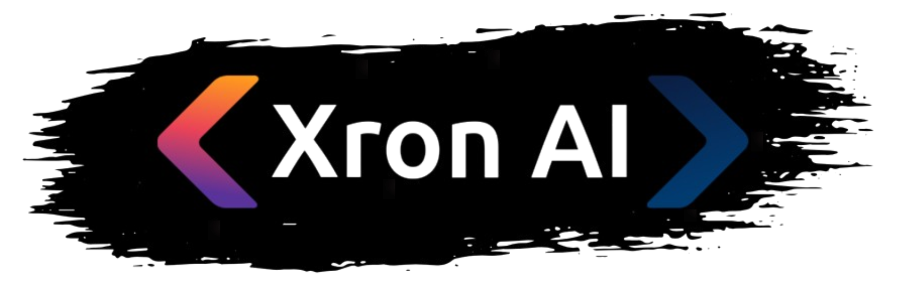
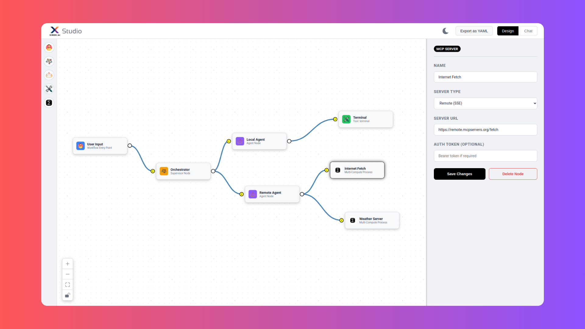

<div align="center">
  <a href="https://www.xron.ai/">
    
  </a>
</div>

<div align="center">
  <h3>The Python SDK for building, orchestrating, and deploying powerful, agentic AI chatbots.</h3>
</div>

<p align="center">
  <a href="https://www.xron.ai/">
    
  </a>
  <a href="https://pypi.org/project/xronai/">
    
  </a>
  <a href="https://docs.xron.ai/">
    
  </a>
  <a href="https://opensource.org/licenses/MIT">
    
  </a>
  <a href="https://pypi.org/project/xronai/">
    
  </a>
</p>

---

**XronAI** provides a robust, hierarchical framework to design and deploy complex AI systems. Define specialized AI **Agents** managed by intelligent **Supervisors** to create sophisticated workflows. Whether you prefer building in Python, defining your system declaratively in YAML, or using a powerful no-code UI, XronAI provides the tools to bring your multi-agent vision to life.

## Key Features

*   👑 **XronAI Studio:** A powerful web-based UI to visually design, test, and export complex agentic workflows without writing a single line of code.
*   **Hierarchical Architecture:** Go beyond single-agent setups. Design sophisticated workflows with Supervisors that delegate tasks to specialized Agents, enabling a clear separation of concerns.
*   📜 **Declarative YAML Workflows:** Define your entire agentic workforce in clean, human-readable YAML files. This makes your systems easy to version control, share, and modify.
*   🚀 **One-Command Deployment:** Use the `xronai serve` command to instantly deploy your workflow as a production-ready API server, complete with an optional chat interface and session management.
*   🛠️ **Extensible Tool System:** Equip your Agents with custom Python functions or pre-built capabilities like the persistent `TerminalTool`.
*   🌐 **MCP Integration:** Seamlessly connect your agents to remote tools and services using the Machine Communication Protocol (MCP), enabling distributed and scalable systems.
*   🧠 **Persistent History & Memory:** Conversations are automatically logged and managed per session, providing your agents with a persistent memory of past interactions.

## Installation

You can install the core XronAI framework directly from PyPI:

```bash
pip install xronai
```

To include the powerful **XronAI Studio** and its dependencies, install the `studio` extra:

```bash
pip install xronai[studio]
```

## Quick Start: Your First Workflow

Before you begin, XronAI needs to know which LLM to use. Create a `.env` file in your project's root directory and add your credentials.

```env
LLM_MODEL="your-model-name"         # e.g., gpt-4-turbo
LLM_API_KEY="your-api-key"
LLM_BASE_URL="your-api-base-url"    # e.g., https://api.openai.com/v1
```

Now, you are ready to build your first agentic workflow!

## Explore the Examples

The best way to learn XronAI is by diving into the hands-on examples provided in the repository. Each script is a self-contained demonstration of a specific feature.

#### Core Concepts

*   **Standalone Agent with History:** [`examples/agent_history_basic.py`](examples/agent_history_basic.py)  
    See the simplest use case: a single agent that remembers your conversation.
*   **Hierarchical Structure:** [`examples/hierarchical_structure.py`](examples/hierarchical_structure.py)  
    Learn how to nest Supervisors to create complex organizational charts for your agents.
*   **Loading Persistent History:** [`examples/history_loading.py`](examples/history_loading.py)  
    Understand how to stop and resume a conversation with a workflow.

#### Tool Usage

*   **Agent with Multiple Tools:** [`examples/agent_tool_usage_benchmark.py`](examples/agent_tool_usage_benchmark.py)  
    A demonstration of how a supervisor can delegate to multiple agents, each with multiple tools, in a single turn.
*   **Connecting to Remote Tools (MCP):** [`examples/agent_with_mcp_tools.py`](examples/agent_with_mcp_tools.py)  
    Learn how an agent can discover and use tools from a remote server using MCP.

#### YAML Configuration

*   **Task Management System from YAML:** [`examples/task_management_with_yaml/`](examples/task_management_with_yaml/)  
    A complete example showing how to define a complex, multi-agent workflow entirely in a `config.yaml` file.

---

## 1. XronAI Studio (No-Code Visual Builder)

The easiest and most powerful way to get started with XronAI is by using the Studio. It's a web-based, drag-and-drop interface where you can visually design, configure, and test your agentic systems in real-time.

Launch the Studio with a simple command:

```bash
xronai studio
```

If you have an existing `workflow.yaml` file you'd like to edit, you can load it directly:

```bash
xronai studio --config path/to/your/workflow.yaml
```

### Design Mode

In Design Mode, you build the structure of your AI team. Drag nodes from the toolbar, configure their system messages and capabilities in the right-hand panel, and connect them to define the hierarchy of delegation.



### Chat Mode

Once you've designed your workflow, click the "Start Chat" button to compile it and interact with it immediately. Test your logic, see how the Supervisor delegates tasks, and debug your system in a live environment.


---

## 2. XronAI Serve (Deploy Your Workflow)

After you've built and tested your workflow in the Studio and exported it as a `workflow.yaml` file, you can deploy it as a production-ready server with a single command.

```bash
xronai serve path/to/your/workflow.yaml
```

This starts a FastAPI server that exposes your workflow via API endpoints.

You can also serve it with a simple web-based chat UI and specify a directory to store all conversation histories:

```bash
xronai serve workflow.yaml --ui --history-dir my-chats
```

This makes it incredibly easy to integrate your XronAI system into any application or to provide a direct interface for users.


---

## 3. Using the Python SDK

For those who prefer a code-first approach, the Python SDK offers full control and flexibility.

### Quick Start in Python

Here’s how to create a simple Supervisor-Agent hierarchy programmatically.

```python
import os
from dotenv import load_dotenv
from xronai import Supervisor, Agent

load_dotenv()

# LLM Configuration
llm_config = {
    "model": os.getenv("LLM_MODEL"),
    "api_key": os.getenv("LLM_API_KEY"),
    "base_url": os.getenv("LLM_BASE_URL"),
}

# Create a specialized agent
coder_agent = Agent(
    name="Coder",
    llm_config=llm_config,
    system_message="You are an expert Python programmer."
)

# Create a supervisor to manage the agent
supervisor = Supervisor(
    name="ProjectManager",
    llm_config=llm_config,
    system_message="You are a project manager. Delegate coding tasks to the Coder agent."
)

# Register the agent with the supervisor
supervisor.register_agent(coder_agent)

# Start chatting with your workflow
if __name__ == "__main__":
    supervisor.start_interactive_session()

```

### YAML Configuration

You can also load a declarative YAML file directly into your Python application using the `AgentFactory`.

```python
import asyncio
from xronai.config import load_yaml_config, AgentFactory

async def main():
    # Load the workflow structure from the YAML file
    config = load_yaml_config("path/to/your/workflow.yaml")

    # The factory constructs the entire agent hierarchy
    supervisor = await AgentFactory.create_from_config(config)

    # Start chatting
    response = supervisor.chat("Write a Python function to add two numbers.")
    print(response)

if __name__ == "__main__":
    asyncio.run(main())
```

### History and Logging

XronAI automatically manages persistent chat history for each session (identified by a `workflow_id`). All interactions—from user queries to agent tool calls—are logged in a structured `history.jsonl` file within the session directory (by default, in `xronai_logs/`). This enables stateful conversations and provides excellent traceability.

### Loading Persistent Chat History

You can easily resume a conversation from a previous session by re-instantiating your workflow with the same `workflow_id`.

```python
from xronai import Supervisor

# Assume 'my_existing_session_id' is the ID of a previous conversation
supervisor = Supervisor(
    name="ProjectManager",
    llm_config=llm_config,
    workflow_id="my_existing_session_id"
)

# The supervisor will automatically load its history and the history
# of all its registered agents for that session.

response = supervisor.chat("What was the last function we were working on?")
print(response)
```

### Advanced Usage: Tools and Hierarchies

You can equip agents with tools and build multi-level supervisor hierarchies.

```python
# Create a tool (a simple Python function)
def add_numbers(a: int, b: int) -> int:
    """Adds two numbers."""
    return a + b

# Define the tool's metadata for the LLM
add_tool_metadata = {
    "type": "function",
    "function": { "name": "add_numbers", "description": "Add two integers."
    # ... (parameters schema)
    }
}

# Create an agent with the tool
math_agent = Agent(
    name="MathAgent",
    llm_config=llm_config,
    tools=[{"tool": add_numbers, "metadata": add_tool_metadata}],
    use_tools=True,
    system_message="You are a calculator."
)

# Create a sub-supervisor
math_supervisor = Supervisor(name="MathSupervisor", llm_config=llm_config, is_assistant=True)
math_supervisor.register_agent(math_agent)

# Register the sub-supervisor under the main one
main_supervisor.register_agent(math_supervisor)

main_supervisor.display_agent_graph()
```

### MCP Server Integration

Connect agents to remote tools served via the Machine Communication Protocol (MCP) by defining `mcp_servers` during initialization.

```python
# Connect to a remote SSE server
sse_server_config = {
    "type": "sse",
    "url": "https://remote.mcpservers.org/fetch",
}

# Connect to a local server launched via stdio
stdio_server_config = {
    "type": "stdio",
    "script_path": "examples/supervisor_multi_mcp/weather_server.py"
}

remote_agent = Agent(
    name="RemoteToolAgent",
    llm_config=llm_config,
    mcp_servers=[sse_server_config, stdio_server_config],
    use_tools=True
)

# The agent will automatically discover and be able to use tools from both servers.
```